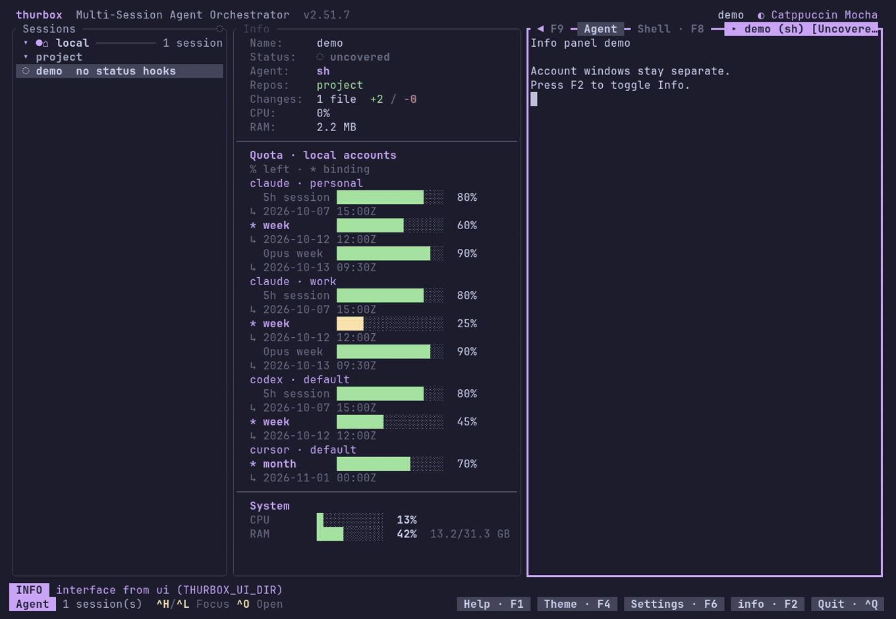

# thurbox-info-panel

Session, git, agent, account quota and system readouts beside the terminal in
[Thurbox](https://github.com/Thurbeen/thurbox). Linux and native Windows use the
same Lua pane and platform shell worker.



The recording uses a disposable profile, a demo repository and mock quota
answers. No credentials are read. Reproduce it with `vhs demo/demo.tape`.

## Install

Requires Thurbox **2.51.7 or later**. Install the pane:

```sh
thurbox-cli plugin install git+https://github.com/Thurbeen/thurbox-info-panel
```

This clones the repository into your interface directory. Add its column in
`layout.lua`, inside the `columns` block before the `center` entry:

```lua
if panels.shown("info") and filled(ctx, "info") then
  columns[#columns + 1] = { slot = "info", pct = 15, min = 28, max = 44 }
end
```

Run `thurbox-cli plugin check`, then press **F2** or click **info**. It follows
`store.selected`; it is a readout and does not take keyboard focus. The compact
layout below 36 columns drops the padded label column. Theme roles follow the
selected light or dark palette.

### Account quotas

Install [quota-axi](https://github.com/kunchenguid/quota-axi), **0.1.58 or later**
(Node.js 22.19 or later), on PATH. On Windows, use native Node.js and npm:

```sh
npm install -g quota-axi
thurbox-cli extension install git+https://github.com/Thurbeen/thurbox-info-panel
```

The companion extension registers one cron automation, once a minute. Its
Node.js script asks each running local interface to refresh; no resident process
or additional quota cache is created. Without the extension, F2 and the command
palette's **refresh local account quotas** still refresh the panel.

**Grant run once:** `Ctrl+,` → `]` (Interface) → select the info-panel file →
`t`. Until you grant it, the panel says **trust run in Interface settings** and
executes nothing. After granting, press F2 twice or use the refresh command.
A missing CLI shows `npm install -g quota-axi`; a pending fetch shows **loading**.

```text
Thurbox heartbeat (once/minute)
  → refresh.mjs → local UI action
  → trusted pane action → background quota-axi worker
  → cached JSON → pure render
```

No polling, process launch or network access happens in `render`. Requests have a
60-second TTL and a 30-second timeout. JSON is decoded only when its contents or
result state change, or the snapshot crosses a minute boundary. The kernel
caches the pure render between changes.

Each configured subscription/account is labelled separately, including multiple
accounts of one provider, and the block reads like fleet's queue-pane FUEL rows:

```text
  Quota left · local accounts             3m ago
  claude · personal █┃█████░░░░░  60%  ↻ 1d 5h
    5h session                    80%  ↻ 3h
    week                          60%  ↻ 1d 5h
    Opus model week               90%  ↻ 5d 21h
  codex             binding unavailable
    session                       33%  ↻ <1m
    week                          45%
```

One line per subscription carries a gauge for its binding window (from
quota-axi's schema 5/6 `quotaSemantics.effectiveAvailability`; the tightest one
when several bind), the percentage remaining and that window's reset. Every
reported window follows on its own indented line, the binding ones in the bold
accent; tied and model-scope bindings are preserved. No providers, accounts or
windows are summed together. Numbers are right-aligned in one column across the
block, and labels are cut with `…` rather than wrapped.

Times are compact countdowns and ages: the two largest units, floored, with no
seconds (`<1m`, `45m`, `5h`, `23h 59m`, `1d 5h`, `10d`; `now` once due). The
reading's age appears beside the heading only once a refresh is overdue (over
90 seconds old).

Below 36 columns the label takes its own line, with the binding window's name
beside it when it fits, and the gauge goes underneath. Every window line is kept
at every width, so Claude's 5h and week windows are always visible. Without
authoritative binding metadata the subscription says **binding unavailable** in
place of its gauge. Gauge colours use the active theme's
good, warning and danger roles: remaining above 40%, above 15% through 40%, and
15% or less; the bar ticks the 15% reserve with `┃`.

Claude, Codex, Cursor, Copilot, Z.AI, Antigravity and other discovered providers
use the same path. Gemini model windows are shown when quota-axi reports them
through Antigravity; the panel does not invent a standalone Gemini adapter.
Providers positively marked `notSetUp` are omitted. Each window uses only its own
measured `percentRemaining`; missing or untrusted readings show **unavailable**,
and stale readings show **stale**, without a number or bar. A failed fetch says
why after **unavailable**: the run did not finish, timed out, had its output
truncated, or exited non-zero (with the first line of its error, cleaned of
terminal escapes and cut to 120 characters), or its output was unreadable or of
an unsupported schema. Cached reports older than five minutes relative to the
snapshot are marked stale. Account emails from the report are not displayed.
Quotas describe **local accounts**, even when the selected session runs on a
remote host: Thurbox runs a program in a session, so the panel runs
quota-axi in the selected session when it is local and otherwise in the first
local one, and says **needs a local session** when there is none.

Remove the scheduler with `thurbox-cli extension uninstall info-panel-refresh`;
remove the pane with `thurbox-cli plugin remove info_panel` and remove the layout
entry. Plugin updates use `thurbox-cli plugin update`.

## Other readouts

| Section | Source |
| --- | --- |
| Session, parent, host, activity and signal | selected session snapshot |
| Repositories, base, changes and sync | session directories and git snapshot |
| Process CPU and RAM | `metrics.sessions[id]` |
| Agent cost, tokens, context, time, cache and lines | optional agent statusline metrics |
| System CPU and RAM | `metrics.system` |
| Enabled automations and schedules | `thurbox.automations` |

Absent metrics are omitted. Process CPU can exceed one core, so it is a plain
percentage rather than a capped gauge. The old agent/host-specific usage section
is replaced by the account quota section. All widths are measured with Thurbox's
injected `text` API, including wrapping and truncation.

## Development

```sh
bash scripts/check.sh
```

The gate bootstraps an isolated release interface under `.cache/`, runs StyLua,
Selene and rumdl, renders fixtures at wide/compact widths, sweeps the preview
scenarios and drives a real TUI with tmux. It needs Python 3, Node.js, Lua 5.4 or later,
Thurbox and those tools on PATH. Tests never grant a capability or change the
live interface. JSON fixtures cover several providers, two accounts, individual
session/weekly/model windows,
unavailable, untrusted and stale readings; render tests cover 28, 44 and 80 columns and forbid worker
requests from drawing. `tests/snapshots/` pins the quota section at 50 and 30 columns
(`lua tests/snapshot.lua .cache/check/ui --update` rewrites them), and
`tests/format.lua` pins the duration format at its boundaries.
Native Windows CI installs and checks the same plugin.

`thurbox.yml` is the release sandbox contract. Host scripts use
`dev/selene.toml`. For a plain-text preview:

```sh
lua dev/preview.lua .cache/check/ui 28 full
```

CI runs on pull requests. Renovate maintains pinned actions
with a seven-day release age. Versioned releases follow conventional commit
subjects (`feat:`, `fix:`, `docs:`); the release tag and `plugin.toml` version must
agree. This change does not publish a release.

## Manual test

Install the PR revision in a disposable interface, place the column as above,
and run `thurbox-cli plugin check`. Open Thurbox, press F2 and grant run in the
Interface tab. With quota-axi on PATH, use the refresh palette command: each
configured account should show one gauge with its reset countdown and every
window under it at 44 columns, with binding labels highlighted, or an honest
status word. At 28 columns, the gauge moves under the label and every window
should still be listed. Install
the companion extension and leave the interface idle
across a minute boundary; its quota answer should refresh without switching
sessions. Hide Info with F2 and show it again. Resize the column to 28 and 44
columns and select a light and a dark theme in Settings: labels, bars and borders
should remain within the column. Uninstall quota-axi in the disposable environment
and refresh: the install command should replace the quota data. The GIF above
shows the mock-data visual path; live provider access requires your own grant.

## License

MIT — see [LICENSE](LICENSE). The JSON decoder is adapted from
[thurbox-auto-continue](https://github.com/Thurbeen/thurbox-auto-continue) (MIT).
